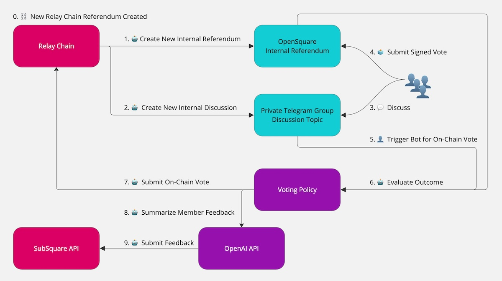

## Voting Policy

Permanence DAO's voting system is powered by the [OpenGov Bot](https://github.com/permanence-dao/permanence-dao-services/tree/main/pdao-telegram-bot), developed as part of the DAO services [code base](https://github.com/permanence-dao/permanence-dao-services).

All internal referenda are recorded in the [OpenSquare Space](https://voting.opensquare.io/space/permanence), ensuring full transparency of members' votes and feedback on each referendum, openly accessible through the OpenSquare API for historical analysis.

### Operation Details

<i>Permanence DAO Voting System</i>

 

A basic explanation of the DAO's voting process and timeline is as follows:

0. A **new relay chain referendum** is created.
1. The **bot fetches** the referendum details and **creates** a matching internal referendum in our [OpenSquare space](https://voting.opensquare.io/space/permanence).
2. The bot creates a **discussion topic** in our Telegram group.
3. **Members discuss** the referendum details. For some referenda, we also reach out to proposers for a call.
4. **Members submit** their **signed votes** on the internal referendum alongside their feedback.
5. A **voting admin triggers** the bot to submit the on-chain vote.
6. The **bot evaluates** the outcome of the referendum against the **voting policy** for the specific track.
7. The **bot submits the on-chain** vote accordingly.
8. The **bot collects all member feedback** and **generates a summary** using the OpenAI API.
9. The **bot submits the final outcome** and **collective feedback** through the **Subsquare API**.

### Per-Track Voting Policy

Permanence DAO utilizes a **per-track voting policy**, allowing us to enforce stricter requirements for critical tracks such as **Root**, **Whitelisted Caller**, **Referendum Canceller**, and **Big Spender**.

Our voting system is defined by three key parameters, encouraging high participation and in-depth internal discussion before any vote is cast. These parameters are:

- **Participation:** The vote defaults to *abstain* until the participation requirement is met. If no participation requirement is defined, the vote defaults to *nay*.
- **Quorum:** The percentage of *aye* votes relative to the total number of DAO members. For example, a 60% quorum requirement means that the vote remains *nay* unless at least 60% of all members vote *aye*.
- **Majority:** The percentage of *aye* votes relative to the total number of votes cast.

Based on these parameters, our voting policy is defined for various OpenGov tracks as follows:

| Track | Participation (≥) | Quorum (≥) | Majority (>) |
| -------- | --------: | --------: | --------: |
| **Small Tipper** | 30% | - | 50% |
| **Big Tipper** | 35% | - | 50% |
| **Small Spender** | 50% | - | 50% |
| **Medium Spender** | - | 50% | 50% |
| **Big Spender** | - | 60% | - |
| **Treasurer** | - | 60% | - |
| **Wish for Change** | - | 60% | - |

All other tracks **(Root, Whitelisted Caller, Staking Admin, General Admin, etc.) follow the same ≥60% quorum policy** as the **Big Spender**, **Treasurer**, and **Wish for Change** tracks.

Our voting policy remains a **work in progress**, to be **iterated and improved through continuous observation**.